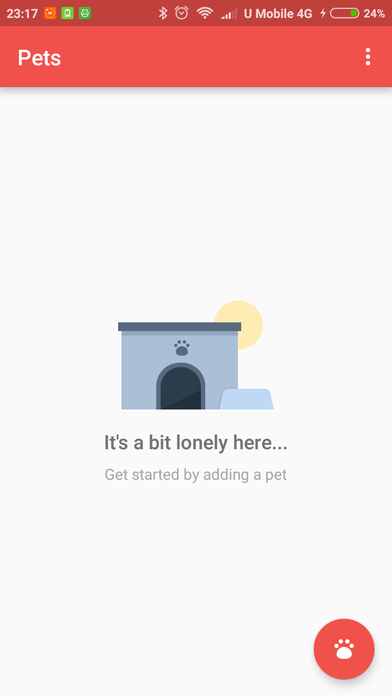
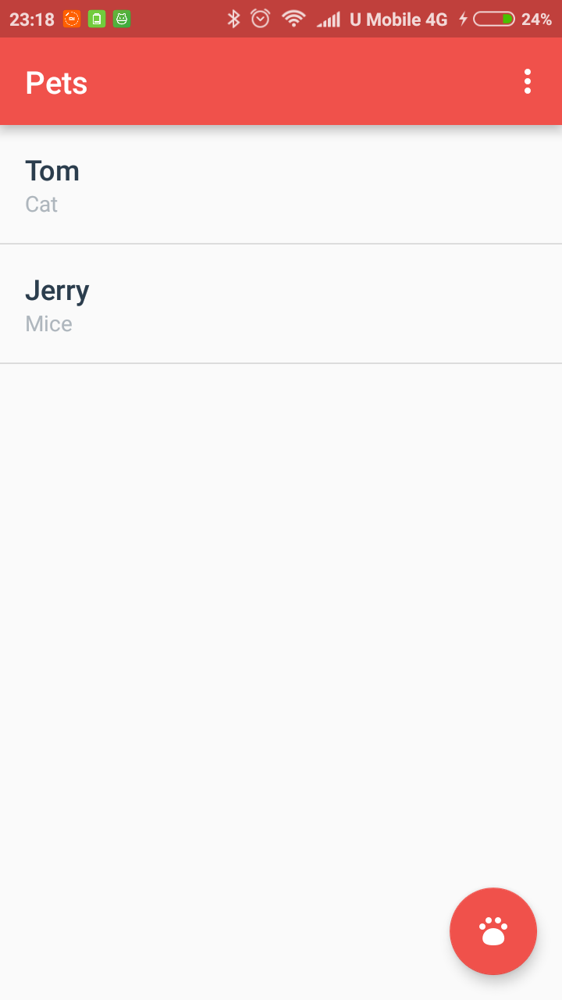
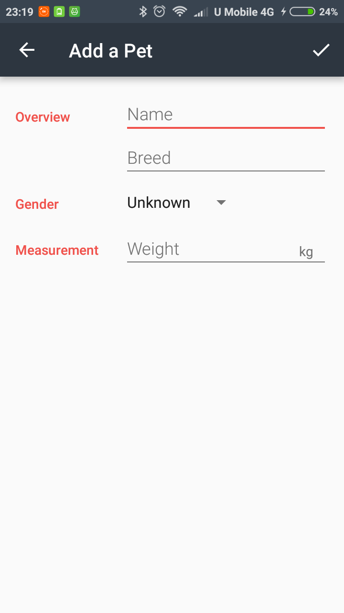
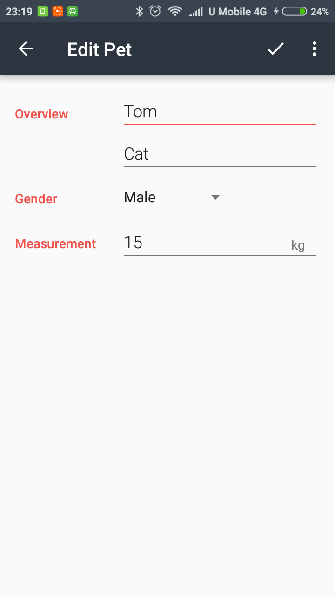

# Pets App

  
  
  
  

## Getting Started

This mobile app displays a list of pets and their related data that the user inputs, which developed during [Udacity's Android Basics: Data Storage Course](https://www.udacity.com/course/android-basics-data-storage--ud845).

## Deployment

Tested on Android 6.0 mobile phone.

## Built With

[Android Studio 3.1.4](https://developer.android.com/studio/) 

## Versioning

[Semantic Versioning (SemVer) 2.0.0](http://semver.org/)

## Authors

**Jerry Chong** - [jerrychong25](https://github.com/jerrychong25)

## License

This project base code is originally provided by Udacity's Android Basics: Data Storage Course Leads Katherine Kuan and Jessica Lin.
